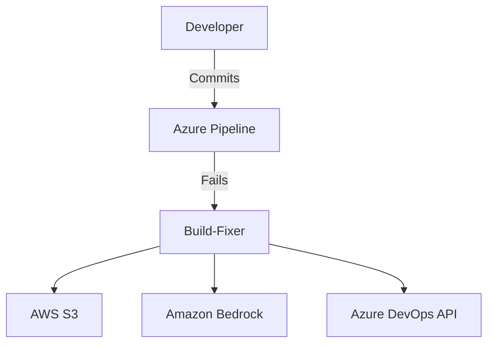

# Architecture Diagrams

This document provides visual representations of Build-Fixer's architecture at various levels of detail.

## System Context Diagram (C4 Level 1)

```
┌─────────────────────────────────────────────────────────────────────┐
│                         System Context                               │
│                                                                      │
│                                                                      │
│   ┌──────────────┐                                                  │
│   │   Developer  │                                                  │
│   │   (Person)   │                                                  │
│   └──────┬───────┘                                                  │
│          │ Commits code,                                            │
│          │ triggers builds                                          │
│          ▼                                                           │
│   ┌──────────────────────┐       Build fails                        │
│   │  Azure DevOps        │────────────────┐                        │
│   │  (External System)   │                │                        │
│   │  - Pipelines         │                │                        │
│   │  - Work Items        │                │                        │
│   │  - Repos             │                │                        │
│   └──────────────────────┘                │                        │
│                                            │                        │
│                                            ▼                        │
│                      ┌────────────────────────────────┐             │
│                      │     Build-Fixer                │             │
│                      │     (Software System)          │             │
│                      │                                │             │
│                      │  Analyzes build failures       │             │
│                      │  using AI and creates          │             │
│                      │  actionable work items         │             │
│                      └────────────┬───────────────────┘             │
│                                   │                                 │
│                      ┌────────────┼────────────┐                   │
│                      │            │            │                   │
│                      ▼            ▼            ▼                   │
│            ┌──────────────┐ ┌──────────┐ ┌──────────────┐         │
│            │   AWS S3     │ │  Amazon  │ │  Azure DevOps│         │
│            │  (Storage)   │ │  Bedrock │ │ Work Items   │         │
│            │              │ │  (AI)    │ │   API        │         │
│            └──────────────┘ └──────────┘ └──────────────┘         │
│                                                                      │
└─────────────────────────────────────────────────────────────────────┘
```

## Container Diagram (C4 Level 2)

```
┌────────────────────────────────────────────────────────────────┐
│                    Build-Fixer System                          │
│                                                                 │
│  ┌──────────────────────────────────────────────────────────┐ │
│  │              CLI Application (Node.js)                   │ │
│  │  ┌────────────┐  ┌──────────────┐  ┌────────────────┐  │ │
│  │  │   index.js │  │ buildFixer.js│  │   config/      │  │ │
│  │  │  (Entry)   │─▶│ (Orchestrator)│  │   .env         │  │ │
│  │  └────────────┘  └──────┬───────┘  └────────────────┘  │ │
│  │                          │                               │ │
│  │         ┌────────────────┼────────────────┐             │ │
│  │         │                │                │             │ │
│  │         ▼                ▼                ▼             │ │
│  │  ┌────────────┐  ┌──────────────┐ ┌────────────────┐  │ │
│  │  │ S3Service  │  │BedrockService│ │AzureDevOpsSvc │  │ │
│  │  │            │  │              │ │               │  │ │
│  │  │ - upload   │  │ - analyze    │ │ - createWI    │  │ │
│  │  │ - download │  │ - parseResp  │ │ - formatDesc  │  │ │
│  │  └─────┬──────┘  └──────┬───────┘ └────────┬───────┘  │ │
│  │        │                │                  │           │ │
│  │        │                │                  │           │ │
│  │  ┌─────┴────────────────┴──────────────────┴───────┐  │ │
│  │  │              Utilities & Helpers                │  │ │
│  │  │  - Log truncation                               │  │ │
│  │  │  - Validation                                   │  │ │
│  │  │  - File I/O                                     │  │ │
│  │  └─────────────────────────────────────────────────┘  │ │
│  └──────────────────────────────────────────────────────────┘ │
│                                                                 │
└────────────────────────────────────────────────────────────────┘
         │                    │                    │
         ▼                    ▼                    ▼
   ┌──────────┐         ┌──────────┐        ┌──────────────┐
   │  AWS S3  │         │ Bedrock  │        │ Azure DevOps │
   │ Bucket   │         │ Runtime  │        │  REST API    │
   └──────────┘         └──────────┘        └──────────────┘
```

## Component Diagram (C4 Level 3) - Core Services

```
┌──────────────────────────────────────────────────────────────────┐
│                      Service Components                           │
│                                                                   │
│  ┌─────────────────────────────────────────────────────────────┐│
│  │                    BedrockService                           ││
│  │                                                             ││
│  │  ┌──────────────────┐    ┌────────────────────────────┐   ││
│  │  │ analyzeLog()     │    │ createAnalysisPrompt()     │   ││
│  │  │                  │───▶│                            │   ││
│  │  │ - Validates input│    │ - Formats log for AI       │   ││
│  │  │ - Calls Bedrock  │    │ - Adds context and         │   ││
│  │  │ - Parses response│    │   instructions             │   ││
│  │  └──────────────────┘    └────────────────────────────┘   ││
│  │           │                                                 ││
│  │           ▼                                                 ││
│  │  ┌──────────────────┐    ┌────────────────────────────┐   ││
│  │  │ parseAnalysis    │    │ BedrockRuntimeClient       │   ││
│  │  │ Response()       │    │ (AWS SDK)                  │   ││
│  │  │                  │    │                            │   ││
│  │  │ - Extracts RCA   │    │ - InvokeModel API          │   ││
│  │  │ - Extracts recs  │    │ - Error handling           │   ││
│  │  │ - Validates      │    │ - Retry logic              │   ││
│  │  └──────────────────┘    └────────────────────────────┘   ││
│  └─────────────────────────────────────────────────────────────┘│
│                                                                   │
│  ┌─────────────────────────────────────────────────────────────┐│
│  │                       S3Service                             ││
│  │                                                             ││
│  │  ┌──────────────────┐    ┌────────────────────────────┐   ││
│  │  │ uploadLog()      │    │ generateS3Key()            │   ││
│  │  │                  │───▶│                            │   ││
│  │  │ - Creates key    │    │ - buildId + timestamp      │   ││
│  │  │ - Uploads to S3  │    │ - Ensures uniqueness       │   ││
│  │  │ - Returns key    │    │ - Prefix structure         │   ││
│  │  └──────────────────┘    └────────────────────────────┘   ││
│  │                                                             ││
│  │  ┌──────────────────┐    ┌────────────────────────────┐   ││
│  │  │ downloadLog()    │    │ S3Client (AWS SDK)         │   ││
│  │  │                  │    │                            │   ││
│  │  │ - Fetches object │    │ - PutObject API            │   ││
│  │  │ - Converts stream│    │ - GetObject API            │   ││
│  │  │ - Returns string │    │ - Server-side encryption   │   ││
│  │  └──────────────────┘    └────────────────────────────┘   ││
│  └─────────────────────────────────────────────────────────────┘│
│                                                                   │
│  ┌─────────────────────────────────────────────────────────────┐│
│  │                  AzureDevOpsService                         ││
│  │                                                             ││
│  │  ┌──────────────────┐    ┌────────────────────────────┐   ││
│  │  │ createWorkItem() │    │ formatDescription()        │   ││
│  │  │                  │───▶│                            │   ││
│  │  │ - Builds payload │    │ - HTML formatting          │   ││
│  │  │ - Calls API      │    │ - Adds build link          │   ││
│  │  │ - Returns WI     │    │ - Sections for RCA/fixes   │   ││
│  │  └──────────────────┘    └────────────────────────────┘   ││
│  │                                                             ││
│  │  ┌──────────────────┐    ┌────────────────────────────┐   ││
│  │  │ initialize()     │    │ WebApi (Azure DevOps SDK)  │   ││
│  │  │                  │    │                            │   ││
│  │  │ - Auth with PAT  │    │ - Work Item Tracking API   │   ││
│  │  │ - Get WIT client │    │ - JSON Patch operations    │   ││
│  │  │ - Validates conn │    │ - Project validation       │   ││
│  │  └──────────────────┘    └────────────────────────────┘   ││
│  └─────────────────────────────────────────────────────────────┘│
└──────────────────────────────────────────────────────────────────┘
```

## Sequence Diagram - Happy Path

```
Developer   Pipeline   Build-Fixer   S3   Bedrock   Azure DevOps
   │            │           │          │      │           │
   │ Commits    │           │          │      │           │
   │───────────▶│           │          │      │           │
   │            │           │          │      │           │
   │            │ Build     │          │      │           │
   │            │ Fails     │          │      │           │
   │            │           │          │      │           │
   │            │ Triggers  │          │      │           │
   │            │─────────▶ │          │      │           │
   │            │           │          │      │           │
   │            │           │ Read log │      │           │
   │            │           │──┐       │      │           │
   │            │           │  │       │      │           │
   │            │           │◀─┘       │      │           │
   │            │           │          │      │           │
   │            │           │ Upload   │      │           │
   │            │           │─────────▶│      │           │
   │            │           │          │      │           │
   │            │           │  S3 key  │      │           │
   │            │           │◀─────────│      │           │
   │            │           │          │      │           │
   │            │           │  Analyze │      │           │
   │            │           │─────────────────▶│           │
   │            │           │          │      │           │
   │            │           │    AI Analysis  │           │
   │            │           │          │      │           │
   │            │           │  RCA + Fixes    │           │
   │            │           │◀─────────────────│           │
   │            │           │          │      │           │
   │            │           │  Create Work Item│           │
   │            │           │─────────────────────────────▶│
   │            │           │          │      │           │
   │            │           │  Work Item URL  │           │
   │            │           │◀─────────────────────────────│
   │            │           │          │      │           │
   │            │ Complete  │          │      │           │
   │            │◀──────────│          │      │           │
   │            │           │          │      │           │
   │ Notification│          │          │      │           │
   │◀───────────│           │          │      │           │
   │            │           │          │      │           │
```

## Deployment Architecture - Enterprise

```
┌────────────────────────────────────────────────────────────────┐
│                        Internet                                 │
└──────────────────────────┬─────────────────────────────────────┘
                           │
                           ▼
┌─────────────────────────────────────────────────────────────────┐
│                     API Gateway                                  │
│  - Authentication (OAuth 2.0)                                   │
│  - Rate Limiting                                                │
│  - Request Routing                                              │
└──────────────────────────┬──────────────────────────────────────┘
                           │
                           ▼
┌─────────────────────────────────────────────────────────────────┐
│                  Load Balancer (ALB/App Gateway)                │
└──────────────────────────┬──────────────────────────────────────┘
                           │
          ┌────────────────┼────────────────┐
          │                │                │
          ▼                ▼                ▼
    ┌─────────┐      ┌─────────┐      ┌─────────┐
    │Worker 1 │      │Worker 2 │      │Worker N │
    │(Pod)    │      │(Pod)    │      │(Pod)    │
    └────┬────┘      └────┬────┘      └────┬────┘
         │                │                │
         └────────────────┼────────────────┘
                          │
         ┌────────────────┼────────────────┐
         │                │                │
         ▼                ▼                ▼
   ┌──────────┐    ┌──────────┐    ┌──────────┐
   │   S3     │    │ Bedrock  │    │Azure DvOp│
   │ (Primary)│    │(us-east-1)│    │   API    │
   └────┬─────┘    └──────────┘    └──────────┘
        │
        │ Replication
        │
        ▼
   ┌──────────┐
   │   S3     │
   │   (DR)   │
   │(us-west-2)│
   └──────────┘

Monitoring & Observability:
┌──────────────────────────────────────────┐
│  CloudWatch / Application Insights       │
│  - Metrics                               │
│  - Logs                                  │
│  - Traces (OpenTelemetry)               │
│  - Alarms                                │
└──────────────────────────────────────────┘
```

## Data Flow Architecture

```
┌───────────────────────────────────────────────────────────┐
│                     Data Flow                              │
│                                                            │
│  1. Ingestion                                             │
│     ┌──────────────┐                                      │
│     │ Build Log    │                                      │
│     │ (Raw)        │                                      │
│     └──────┬───────┘                                      │
│            │                                               │
│            ▼                                               │
│     ┌──────────────┐                                      │
│     │ Validation & │                                      │
│     │ Sanitization │ ◀── Redact PII, secrets             │
│     └──────┬───────┘                                      │
│            │                                               │
│  2. Storage                                               │
│            ▼                                               │
│     ┌──────────────┐     ┌──────────────┐                │
│     │ S3 Standard  │────▶│ S3 Glacier   │                │
│     │ (0-90 days)  │     │ (90d-7y)     │                │
│     └──────┬───────┘     └──────────────┘                │
│            │                                               │
│  3. Processing                                            │
│            ▼                                               │
│     ┌──────────────┐                                      │
│     │ Truncation   │ ◀── Optimize for AI (1000 lines)    │
│     └──────┬───────┘                                      │
│            │                                               │
│            ▼                                               │
│     ┌──────────────┐                                      │
│     │ AI Analysis  │ ◀── Bedrock Claude 3 Sonnet         │
│     └──────┬───────┘                                      │
│            │                                               │
│  4. Output                                                │
│            ▼                                               │
│     ┌──────────────┐     ┌──────────────┐                │
│     │ Work Item    │     │ Metrics &    │                │
│     │ (Azure DvOp) │     │ Analytics    │                │
│     └──────────────┘     └──────────────┘                │
│                                                            │
└───────────────────────────────────────────────────────────┘
```

## Security Architecture

```
┌──────────────────────────────────────────────────────────┐
│                  Security Layers                          │
│                                                           │
│  Layer 7: Application Security                           │
│  ┌────────────────────────────────────────────────────┐  │
│  │ - Input validation                                 │  │
│  │ - Output encoding                                  │  │
│  │ - SAST/DAST scanning                              │  │
│  └────────────────────────────────────────────────────┘  │
│                                                           │
│  Layer 6: Data Security                                  │
│  ┌────────────────────────────────────────────────────┐  │
│  │ - Encryption at rest (AES-256)                     │  │
│  │ - Encryption in transit (TLS 1.3)                  │  │
│  │ - Data classification & DLP                        │  │
│  └────────────────────────────────────────────────────┘  │
│                                                           │
│  Layer 5: Identity & Access                              │
│  ┌────────────────────────────────────────────────────┐  │
│  │ - MFA enforcement                                  │  │
│  │ - RBAC/ABAC                                        │  │
│  │ - Least privilege principle                       │  │
│  │ - Service principals                              │  │
│  └────────────────────────────────────────────────────┘  │
│                                                           │
│  Layer 4: Network Security                               │
│  ┌────────────────────────────────────────────────────┐  │
│  │ - VPC/VNet isolation                              │  │
│  │ - Security groups / NSGs                          │  │
│  │ - Private endpoints                               │  │
│  │ - WAF rules                                       │  │
│  └────────────────────────────────────────────────────┘  │
│                                                           │
│  Layer 3: Monitoring & Detection                         │
│  ┌────────────────────────────────────────────────────┐  │
│  │ - CloudTrail / Activity Logs                      │  │
│  │ - GuardDuty / Security Center                     │  │
│  │ - Real-time alerts                                │  │
│  │ - SIEM integration                                │  │
│  └────────────────────────────────────────────────────┘  │
│                                                           │
└──────────────────────────────────────────────────────────┘
```

## Evolution Path

```
Phase 1: MVP (Current)           Phase 2: Scale (v2.0)          Phase 3: Platform (v3.0)
┌──────────────┐                 ┌──────────────┐              ┌──────────────┐
│              │                 │              │              │              │
│  CLI Tool    │                 │  REST API    │              │ SaaS Platform│
│              │                 │              │              │              │
│  Sync        │────────────────▶│  Async Queue │─────────────▶│  Multi-tenant│
│  Processing  │                 │              │              │              │
│              │                 │  Workers     │              │  Self-service│
│  Azure       │                 │              │              │              │
│  DevOps Only │                 │  Multi-CI/CD │              │  Marketplace │
│              │                 │              │              │              │
└──────────────┘                 └──────────────┘              └──────────────┘
   ~ 1 team                        ~ 100 teams                   ~ Unlimited
   10 builds/day                   1000 builds/day               100K+ builds/day
   Manual config                   API-driven                    Self-service
```

---

## Diagram Conventions

### Icons & Symbols
- 📦 **Component**: A software component or module
- 🔧 **Service**: An external service or API
- 💾 **Data Store**: Database or storage system
- 👤 **Actor**: Person or external system
- 🔒 **Security**: Security control or mechanism
- ⚡ **Event**: Async event or message
- 🔄 **Process**: Processing step or workflow

### Line Types
- `──▶` Synchronous call/flow
- `··▶` Asynchronous call/flow
- `─ ─▶` Optional flow
- `═══▶` Data flow

### Colors (when rendered)
- **Blue**: Core components
- **Green**: External services (AWS)
- **Orange**: External services (Azure)
- **Red**: Security boundaries
- **Gray**: Infrastructure

---

## Tools for Rendering

These diagrams can be rendered using:
- **ASCII Art**: As shown (copy-paste friendly)
- **PlantUML**: For automated diagram generation
- **Mermaid**: For GitHub/Markdown rendering
- **Draw.io**: For interactive editing
- **Lucidchart**: For collaborative editing

**Example Mermaid Conversion**:


---

**Last Updated**: 2024-01-15  
**Maintained By**: Architecture Team  
**Review Frequency**: Quarterly or on major changes
